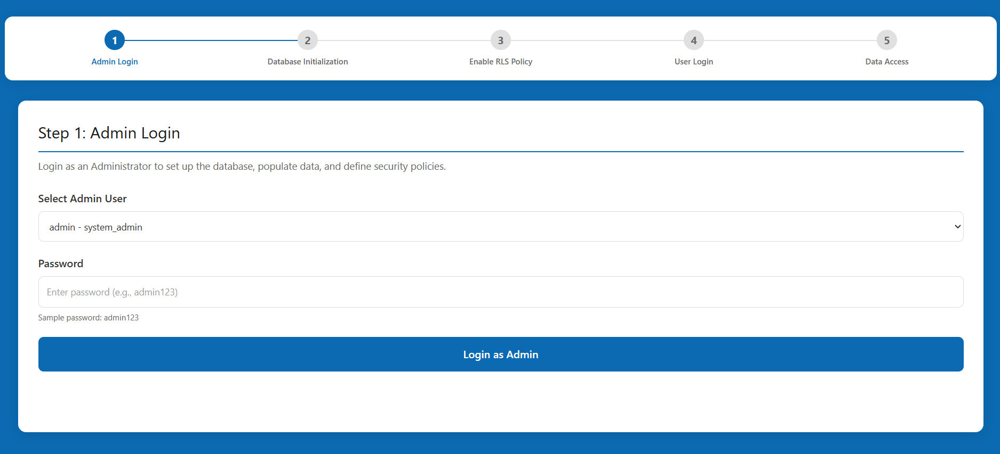
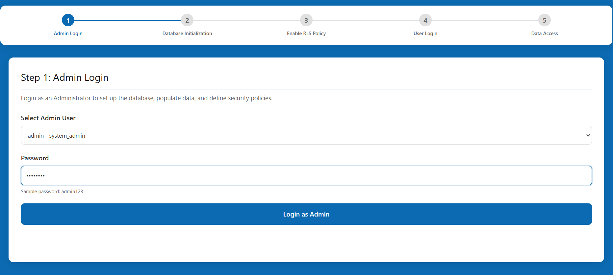
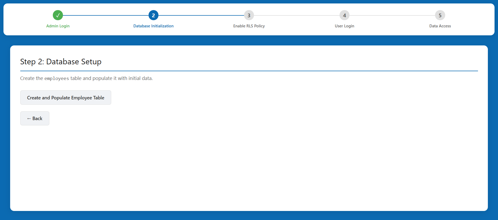
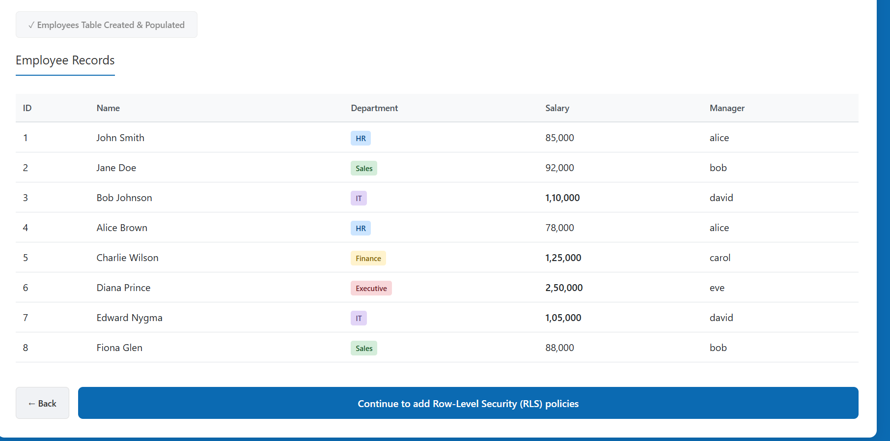
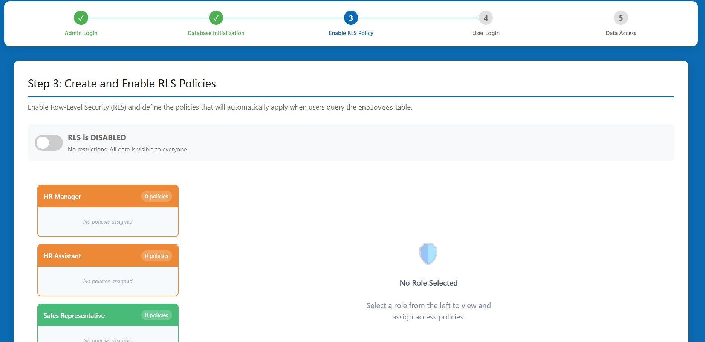
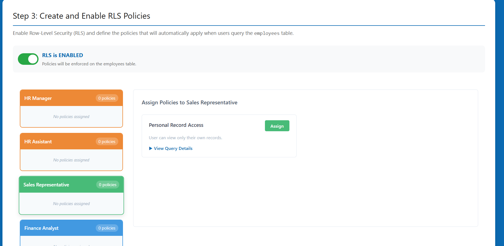
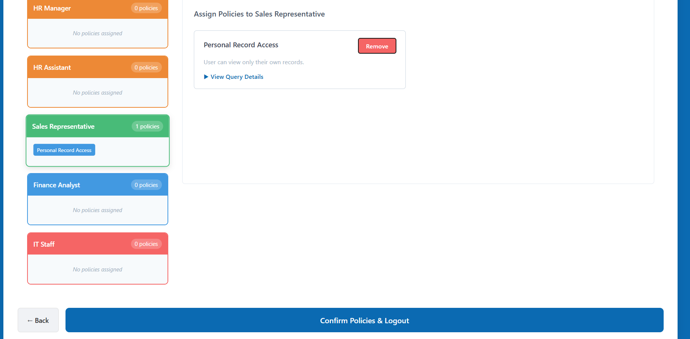
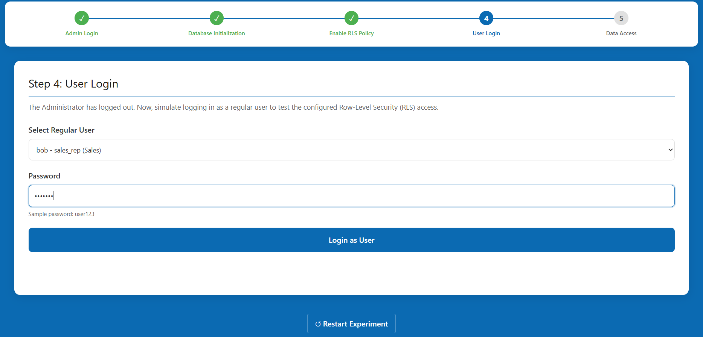
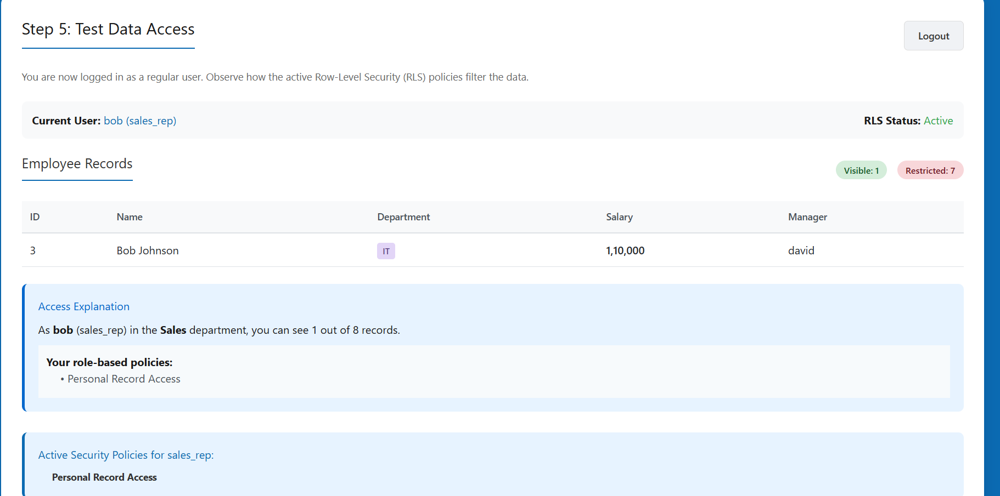

**Step 1: Administrator Authentication**

1. On the "Admin Login" screen, enter the administrator credentials.
   - Username: `admin`
   - Password: `admin123`
   
2. Click the **Login as Admin** button to proceed.

**Step 2: Database Initialization**

1. Click the Create and Populate Employee Table button to populate the database with sample employee records across different departments (HR, Sales, Finance, and IT).
   
2. Click **Continue to add Row-Level Security (RLS) policies** to proceed to security configuration.
   

**Step 3: Role-Level Security (RLS) Configuration**

1. Read the explanation of Row-Level Security.
2. Toggle the **RLS is DISABLED** switch to **RLS is ENABLED**.
 
   
    
   
3. Assign required security policies to different organizational roles by clicking Assign for the required policy:
   - **HR Manager**: Assign the **Full Employee Access** policy.
   - **HR Assistant**: Assign the **Basic Information Access** policy.
   - **Sales Representative**: Assign the **Personal Record Access** policy.
    
     
   - **IT Staff**: Assign the **Department Based Access** (or **Basic Information Access**).
   - **Finance Analyst**: Assign the **Department Based Access** policy.
4. Click **Confirm Policies & Logout** at the bottom of the page.

**Step 4: End-User Login Simulation**

1. On the "User Login" screen, select a regular user from the dropdown menu to simulate their permissions (e.g., `bob - sales_rep (Sales)`).
2. Enter the sample user password: `user123`.
3. Click **Login as User**.

**Step 5: Testing Data Access Restrictions**

1. On the "Test Data Access" screen, observe the Employee Records table.
2. Note how the Active Security Policies have modified the viewport:
   - For example, if you logged in as a Sales Representative, you will notice that you can only see your own record (`Personal Record Access` policy).
   - If logged in as an HR Assistant, you will see all records, but the salary information will be masked (`Basic Information Access` policy).
    
   
    

3. Review the "Active Security Policies" section below the table to confirm which policy is currently enforced.
4. Click the **Logout** button at the top right to return to Step 4 and test accessibility with a different user role.
5. To restart the entire database setup, click **↺ Restart Experiment** at the bottom of the page.
